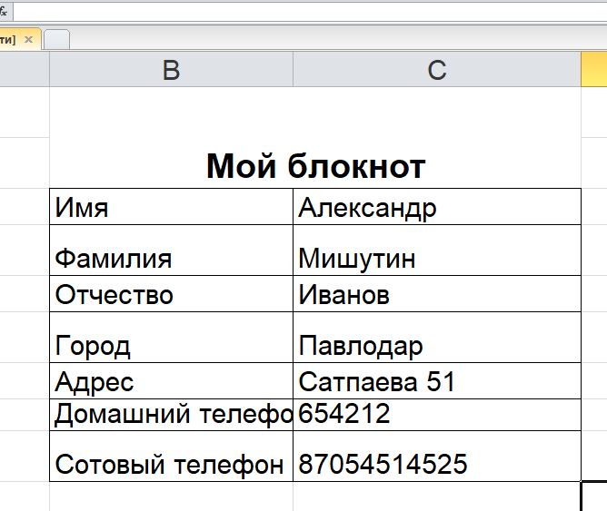
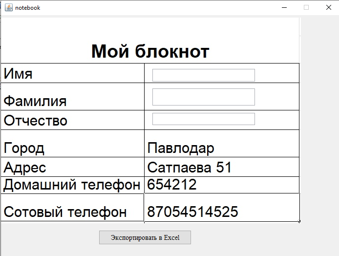

# BMK_JAVA_poi.msexcel

Программа формирования оригинального отчета (заполненного бланка) в MS Excel с использованием Apache POI 

Решение 6 лабораторной работы 
Вариант - 4 (Блокнот)

Интерфейс программы: 
  
Данные, экспоритрованные в Excel: 

